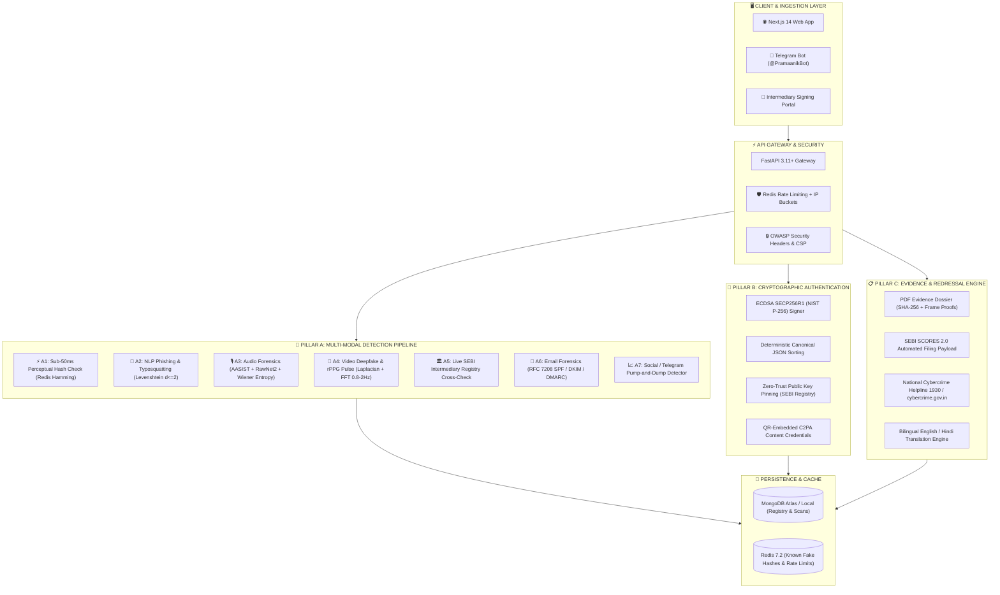

# 🛡️ PRAMAAN-SHIELD (प्रमाण शील्ड)

<div align="center">

### **A Unified Detection, Authentication & Redressal Engine for Securities Market Communications**
*Built for SEBI Securities Market TechSprint 2026*

[](https://sebi.gov.in)
[](https://pramaan-shield.vercel.app/)
[](https://github.com/prakashshiromani/PRAMAAN-SHIELD)
[](https://fastapi.tiangolo.com/)
[](https://nextjs.org/)
[-4B0082?style=for-the-badge)](file:///c:/Users/Prakash%20Max/OneDrive/Desktop/sbi%20project/doce/SECURITY.md)
[](file:///c:/Users/Prakash%20Max/OneDrive/Desktop/sbi%20project/backend/tests)
[](LICENSE)

[🌐 **Live Web Application**](https://pramaan-shield.vercel.app/) • [📖 **Interactive API Docs (Swagger)**](http://localhost:8000/docs) • [📊 **Threat Analytics Dashboard**](https://pramaan-shield.vercel.app/dashboard) • [🔏 **Issuer Seal Portal**](https://pramaan-shield.vercel.app/seal-portal)

</div>

---

## 📌 1. Executive Summary & Problem Context

Financial fraud across India's capital markets has experienced an aggressive paradigm shift. Traditional crude spam has been superseded by hyper-realistic synthetic media, AI-cloned voices of market leaders, algorithmic pump-and-dump coordination, and homograph-based typosquatted broker domain infrastructure.

According to research by **Deloitte and McAfee**, deepfake-driven financial scams surged by **>550%**, with projected cumulative losses touching **₹70,000 Crore**. 

```
                                  THE CRITICAL CHALLENGE
   ┌──────────────────────────────────────────────────────────────────────────────────┐
   │  🚨 Jan 2026: BSE CEO deepfake video promoting fake stock tips went viral.       │
   │  🚨 Nov 2025: SEBI advisory on widespread impersonation of registered brokers.    │
   │  🚨 May 2026: SEBI mandate requiring verifiable social media entity credentials. │
   └──────────────────────────────────────────────────────────────────────────────────┘
```

### The Dual Fundamental Failure in Current Defenses:
1. **The Detection Arms Race**: Standalone AI detectors suffer from continuous false positives and decay as generative models improve. Detection alone is an endless catch-up game.
2. **The Verification Void**: There is currently no standardized, deterministic cryptographic channel for retail investors to verify whether an official circular, press release, advisory, or research report genuinely originated from a SEBI-registered entity.

**PRAMAAN-SHIELD (प्रमाण शील्ड)** solves this crisis through a unified, clinical-grade **Three-Pillar Architecture**:
* **Pillar A — Detection (Is this fake?)**: Multi-modal parallel analysis pipeline detecting deepfake videos, rPPG cardiac pulses, blink rates, voice clones, typosquatted broker domains, email authentication headers, and pump-and-dump groups.
* **Pillar B — Authentication (Is this real?)**: Cryptographic **PRAMAAN Seals** using ECDSA SECP256R1 digital signatures embedded in tamper-evident QR codes, aligned with the international **C2PA Content Credentials standard**.
* **Pillar C — Redressal (How to act?)**: One-tap automated generation of actionable, evidence-backed complaint dossiers for **SEBI SCORES 2.0** and the **National Cybercrime Helpline (1930 / cybercrime.gov.in)** in English and Hindi.

---

## 🏛️ 2. System Architecture



---

## 🔬 3. Deep-Dive: The Three Pillars

### 🅰️ Pillar A — Multi-Modal Detection (Is this fake?)

```
 ┌────────────────────────────────────────────────────────────────────────────────────────┐
 │                              DETECTION PIPELINE BREAKDOWN                              │
 ├─────────────────────────┬───────────────────────────────┬──────────────────────────────┤
 │ Modality                │ Technical Implementation      │ Forensic Signal              │
 ├─────────────────────────┼───────────────────────────────┼──────────────────────────────┤
 │ ⚡ Sub-50ms Hash Cache  │ pHash / dHash & Hamming dist  │ Catches recirculated fakes   │
 │ 🎥 Video Deepfake       │ MTCNN + Laplacian Gradient    │ Synthetic skin over-smooth   │
 │ 💓 Biological Liveness  │ Forehead rPPG + FFT (0.8–2Hz) │ Cardiac blood pulse (BPM)    │
 │ 👁️ Blink Tracking       │ OpenCV Eye Cascade Correlator │ Eye blink frequency/sec      │
 │ 🎙️ Audio Anti-Spoofing  │ AASIST + RawNet2 Waveform     │ Spectral flatness (Entropy)  │
 │ 🌐 Phishing & Domains   │ Levenshtein Distance (d <= 2) │ 200+ SEBI broker domain check│
 │ 📧 Email Header Auth    │ RFC 7208 / 6376 / 7489 Parser │ SPF, DKIM & DMARC alignment  │
 │ 🤖 AI Text & Prompt     │ Gemini 2.0 Flash + <<<GUARDS>>>| Impersonation & urgency NLP │
 └─────────────────────────┴───────────────────────────────┴──────────────────────────────┘
```

#### 1. Video Deepfake & Biological Liveness Forensics
* **Optimized Frame Sampling**: Samples every 10th frame (up to 30 frames max) with frame-grab optimization for sub-second analysis.
* **Laplacian Gradient Heatmap**: Computes gradient magnitude across $224 \times 224$ face crops, normalizes, inverts, and applies JET colormap (`cv2.COLORMAP_JET`). Highlights unnatural smoothing and edge warping common in synthetic faces.
* **rPPG Cardiac Pulse Extraction**: Isolates forehead Region of Interest (ROI) green-channel variations over time; performs Fast Fourier Transform (FFT) in the 0.8–2.0 Hz biological band ($48 - 120\text{ BPM}$). Deepfakes exhibit flatline or erratic pulse spectra.
* **Eye Blink Temporal Dynamics**: Measures eye state variance across time. Deepfake generators frequently struggle with natural periodic blinking ($< 0.1\text{ blinks/sec}$ flags synthetic origin).

#### 2. Voice Clone & Acoustic Anti-Spoofing
* **AASIST Graph Attention Model**: Analyzes spectral flatness (Wiener entropy), energy variance, and zero-crossing rates. Synthetic text-to-speech (TTS) outputs exhibit unnaturally uniform spectral distribution.
* **RawNet2 Raw Waveform Model**: Examines dynamic crest factor ($\text{Peak} / \text{RMS}$), envelope autocorrelation periodicity, and micro-silence distribution.
* **Dual Runtime Engine**: Seamlessly transitions between **Production Deep Learning Mode** (when PyTorch `.pth` weights are loaded) and zero-dependency **Acoustic Signal Processing Fallback**.

#### 3. Text Phishing & Typosquatting Classifier
* **Levenshtein Distance Analysis**: Extracts all URLs and computes string edit distance ($d \le 2$) against **200+ legitimate SEBI-registered broker and exchange domains** (`zerodha.com`, `groww.in`, `sebi.gov.in`, `bseindia.com`, `angelone.in`, `upstox.com`).
* **Entity-Domain Binding**: Cross-checks whether the brand mentioned in text matches the destination domain, exposing impersonators using real brand names with deceptive links.
* **Prompt Injection Defense**: Text sent to **Gemini 2.0 Flash** LLM is encapsulated within strict `<<<UNTRUSTED_CONTENT>>>` system isolation fences to neutralize prompt override attacks.

#### 4. Email Header Forensics (.EML)
* Full parsing of RFC 7208 (SPF), RFC 6376 (DKIM signatures), and RFC 7489 (DMARC policy alignment).
* Clear visual authentication badges (`SPF: ✅ | DKIM: ✅ | DMARC: ❌`) displaying envelope sender vs. display name discrepancies.

---

### 🅱️ Pillar B — Cryptographic Authentication (Is this real?)

Detection alone creates a never-ending arms race. **PRAMAAN-SHIELD** provides a deterministic cryptographic solution for official market communications.

```
       ISSUER SIGNING FLOW (Intermediary / SEBI)
 ┌──────────────────────┐    Canonical JSON    ┌──────────────────────┐    SECP256R1 Private Key   ┌──────────────────────┐
 │ Circular / Advisory  │ ───────────────────> │ SHA-256 Payload Hash │ ─────────────────────────> │ ECDSA Signature + QR │
 └──────────────────────┘                      └──────────────────────┘                            └──────────────────────┘

       INVESTOR VERIFICATION FLOW (Retail User)
 ┌──────────────────────┐    Resolve Reg. ID   ┌──────────────────────┐    Pinned Public Key       ┌──────────────────────┐
 │ Scan PRAMAAN Seal QR │ ───────────────────> │ Fetch from SEBI DB   │ ─────────────────────────> │ Deterministic YES/NO │
 └──────────────────────┘                      └──────────────────────┘                            └──────────────────────┘
```

* **Asymmetric Key Cryptography**: SECP256R1 (NIST P-256) ECDSA digital signatures.
* **Deterministic Canonical Serialization**: Payload keys are sorted deterministically prior to SHA-256 hashing, guaranteeing reproducible signature validation.
* **Zero-Trust Key Pinning**: Public verification keys are retrieved strictly from the authoritative `sebi_registry` database, **never trusted from the QR payload**.
* **C2PA Standard Alignment**: Metadata structure adheres to the Coalition for Content Provenance and Authenticity (C2PA) framework used by Adobe, Microsoft, and BBC.

---

### 🅲 Pillar C — Actionable Redressal & Reporting (How to act?)

When fraud is confirmed, victims need instant, frictionless recourse.

```
                                  REDRESSAL ENGINE
   ┌──────────────────────────────────────────────────────────────────────────────────┐
   │  📄 Court-Ready Forensic PDF Dossier                                             │
   │     • Exact timestamp, SHA-256 file hashes, domain WHOIS records                 │
   │     • Video manipulation heatmaps & audio spectrogram evidence images            │
   │     • Intermediary registry impersonation proof                                  │
   ├──────────────────────────────────────────────────────────────────────────────────┤
   │  🏛️ SEBI SCORES 2.0 Direct Integration Payload                                   │
   │     • Pre-categorized complaint type, broker registration number, evidence link   │
   ├──────────────────────────────────────────────────────────────────────────────────┤
   │  🚨 National Cybercrime Reporting Portal (1930 / cybercrime.gov.in)              │
   │     • Bilingual (English & Hindi) pre-formatted complaint narratives             │
   └──────────────────────────────────────────────────────────────────────────────────┘
```

---

## 🎯 4. Trust Scoring Model & Circuit Breakers

Every scan initiates at a neutral **50 / 100 Baseline Score**.

```
    0 ────────────── 30 ────────────────────── 70 ────────────── 100
      🔴 SUSPICIOUS      🟡 EXERCISE CAUTION      🟢 VERIFIED
```

### Deterministic Hard Gate Rules (Circuit Breakers):
| Trigger Condition | Rule Action | Final Classification |
| :--- | :--- | :--- |
| **Known Fake Hash Match** | Hard Cap $\le 15$ | 🔴 **SUSPICIOUS** |
| **Typosquatted / Impersonated Broker Domain** | Hard Cap $\le 15$ | 🔴 **SUSPICIOUS** |
| **Deepfake Video Detected ($P > 0.5$)** | Hard Cap $\le 15$ | 🔴 **SUSPICIOUS** |
| **Synthetic Voice Clone Detected ($P > 0.5$)**| Hard Cap $\le 15$ | 🔴 **SUSPICIOUS** |
| **Valid Cryptographic PRAMAAN Seal** | Hard Floor $\ge 90$ | 🟢 **VERIFIED** |

---

## 🌐 5. Live Production Deployment

> **PRAMAAN-SHIELD is already live — no setup required to try it!**

```
  ┌─────────────────────────────────────────────────────────────────────────────────┐
  │                        PRODUCTION DEPLOYMENT TOPOLOGY                          │
  ├──────────────────────────────┬──────────────────────────────────────────────────┤
  │  🎨 FRONTEND (Vercel)        │  ⚡ BACKEND API (Render — Singapore Region)      │
  │  Next.js 14 / Static CDN     │  FastAPI 3.11+ / Uvicorn / Python 3.11           │
  │  https://pramaan-shield.     │  MONGO_URI → MongoDB Atlas                      │
  │      vercel.app              │  REDIS_URL → Upstash / External Redis            │
  │  SEBI TechSprint Demo App    │  Gemini 2.0 Flash for NLP Intelligence           │
  └──────────────────────────────┴──────────────────────────────────────────────────┘
```

### 🌐 What is `https://pramaan-shield.vercel.app/`?

[**pramaan-shield.vercel.app**](https://pramaan-shield.vercel.app/) is the **live, publicly accessible production deployment** of PRAMAAN-SHIELD, hosted for the SEBI Securities Market TechSprint 2026 evaluation. It is a complete Next.js 14 web application deployed on Vercel's global CDN and connected to the production FastAPI backend hosted on Render (Singapore region).

| Page | Live URL | What it does |
| :--- | :--- | :--- |
| 🏠 **Landing / Home** | [`/`](https://pramaan-shield.vercel.app/) | Certificate-style landing page with fraud vs authentic sample previews |
| 🔍 **Forensic Scanner** | [`/scan`](https://pramaan-shield.vercel.app/scan) | Upload text, URL, video, audio, .EML or image for multi-modal threat analysis |
| 🔏 **Verify PRAMAAN Seal** | [`/verify`](https://pramaan-shield.vercel.app/verify) | Paste a QR payload to get a deterministic cryptographic YES/NO verdict |
| 🏛️ **Issuer Seal Portal** | [`/seal-portal`](https://pramaan-shield.vercel.app/seal-portal) | SEBI intermediaries sign official communications with ECDSA PRAMAAN Seals |
| 📊 **Threat Dashboard** | [`/dashboard`](https://pramaan-shield.vercel.app/dashboard) | Real-time scan telemetry, threat type analytics, and registry statistics |
| 📋 **Redressal & Report** | [`/report`](https://pramaan-shield.vercel.app/report) | Generates SEBI SCORES & Cybercrime 1930 complaint dossiers + PDF download |

---

## 🚀 6. Quick Start & Local Development

### Prerequisites
* **Python**: `3.11+`
* **Node.js**: `20.x+` & `npm`
* **MongoDB**: `7.0+` (Graceful In-Memory fallback active if offline)
* **Redis**: `7.2+` (Graceful In-Memory fallback active if offline)

---

### 📦 Option A: Standard Local Setup

#### Step 1: Clone Repository
```bash
git clone https://github.com/prakashshiromani/PRAMAAN-SHIELD.git
cd PRAMAAN-SHIELD
```

#### Step 2: Backend Setup
```powershell
# Navigate to backend
cd backend

# Create & activate Python virtual environment
python -m venv venv
.\venv\Scripts\Activate.ps1       # Windows PowerShell
# source venv/bin/activate        # Linux / macOS

# Install dependencies
pip install -r requirements.txt

# Seed Database with SEBI Registered Intermediaries & Known Fake Hashes
python -m app.db.seed

# Start FastAPI server
uvicorn app.main:app --reload --port 8000
```

| | Local Development | Live Production |
| :--- | :--- | :--- |
| 🔗 **API Base** | `http://localhost:8000` | Render (Singapore) |
| 📖 **Swagger Docs** | [`http://localhost:8000/docs`](http://localhost:8000/docs) | `/docs` on Render URL |
| ❤️ **Health Check** | [`http://localhost:8000/health`](http://localhost:8000/health) | `/health` on Render URL |

#### Step 3: Frontend Setup
```powershell
# Open a new terminal and navigate to frontend
cd frontend

# Install Node modules
npm install

# Start Next.js Development Server
npm run dev
```

| | Local Development | Live Production (Vercel) |
| :--- | :--- | :--- |
| 🌐 **Web App** | [`http://localhost:3000`](http://localhost:3000) | [**pramaan-shield.vercel.app**](https://pramaan-shield.vercel.app/) |
| 🔍 **Scanner** | [`http://localhost:3000/scan`](http://localhost:3000/scan) | [`/scan`](https://pramaan-shield.vercel.app/scan) |
| 🔏 **Verify** | [`http://localhost:3000/verify`](http://localhost:3000/verify) | [`/verify`](https://pramaan-shield.vercel.app/verify) |
| 📊 **Dashboard** | [`http://localhost:3000/dashboard`](http://localhost:3000/dashboard) | [`/dashboard`](https://pramaan-shield.vercel.app/dashboard) |

---

### 🐳 Option B: Docker Compose Setup

Run the entire multi-service stack with a single command:

```bash
docker-compose up --build
```

Services initialized:
* **Frontend**: [`http://localhost:3000`](http://localhost:3000)
* **Backend API**: [`http://localhost:8000`](http://localhost:8000) → Swagger: [`/docs`](http://localhost:8000/docs)
* **MongoDB**: `localhost:27017`
* **Redis**: `localhost:6379`

---

## 🧪 7. Testing & Quality Assurance

PRAMAAN-SHIELD contains an extensive, automated PyTest suite covering unit tests, integration pipelines, cryptographic determinism, and benchmark performance:

```powershell
cd backend
.\venv\Scripts\Activate.ps1
python -m pytest tests/ -v
```

### Test File Coverage:
| Test File | What it tests |
| :--- | :--- |
| `test_analytics.py` | Dashboard stats endpoint & scan/seal/report analytics increments |
| `test_api_endpoints.py` | All FastAPI route integration tests (health, scan, verify, seal, report, dashboard) |
| `test_audit_service.py` | Immutable audit trail & invalid action guard |
| `test_benchmarks.py` | Hash lookup sub-50ms latency, typosquat accuracy, voice & video model benchmarks |
| `test_config.py` | Settings load & environment defaults |
| `test_determinism.py` | Hard gate finality, verdict boundaries, duplicate scan idempotency, offline fallback |
| `test_determinism_llm.py` | LLM-health independence of verdicts, injection gate, registry boost determinism |
| `test_entity_binding.py` | SEBI & broker impersonation blocks, genuine advisory pass-through |
| `test_gemini_rotation.py` | Round-robin API key rotation, 429 auto-failover, cooldown exhaustion |
| `test_hash_service.py` | Hamming distance, pHash, known-fake match (Redis online & offline parity) |
| `test_live_demo_cases.py` | End-to-end live demo: phishing email, deepfake video, real SEBI circular |
| `test_mongodb_schemas.py` | MongoDB collection schema validation |
| `test_pdf_generator.py` | Evidence PDF generation with SHA-256 proofs |
| `test_phishing_service.py` | Phishing text & URL classifier accuracy |
| `test_privacy.py` | DPDP Act 2023 zero-retention & IP anonymization |
| `test_seal_engine.py` | ECDSA sign → verify → revoke lifecycle |
| `test_social_service.py` | Telegram pump-and-dump pattern detection |
| `test_trust_score.py` | Trust score aggregation & circuit breaker logic |

---

## 📡 8. API Reference

| Endpoint | Method | Description |
| :--- | :--- | :--- |
| `/api/scan` | `POST` | Multi-modal scan for text, URL, video, audio, image, and .EML emails |
| `/api/verify` | `POST` | Deterministic verification of PRAMAAN cryptographic seal payloads |
| `/api/seal/sign` | `POST` | Issues an ECDSA NIST P-256 signed PRAMAAN seal with QR code |
| `/api/seal/{id}/qr` | `GET` | Fetches the standalone high-resolution QR image for a seal |
| `/api/report` | `POST` | Generates standardized complaint payloads for SCORES & Cybercrime 1930 |
| `/api/report/{id}/pdf` | `GET` | Downloads the compiled forensic PDF evidence dossier |
| `/api/dashboard/stats` | `GET` | Returns aggregated threat telemetry and real-time statistics |
| `/api/webhook` | `POST` | Telegram bot webhook for retail investor message forwarding |
| `/health` | `GET` | System health check and service readiness status |

---

## 📂 9. Project Structure

```
PRAMAAN-SHIELD/
├── backend/
│   ├── app/
│   │   ├── crypto/                  # ECDSA SECP256R1 Signing Engine
│   │   │   ├── seal_engine.py       # Core ECDSA sign, verify, revoke & QR generation
│   │   │   └── keys/                # Per-entity keypair storage (gitignored in prod)
│   │   ├── data/                    # Static reference data & in-memory fallback stores
│   │   │   ├── sebi_registry.json   # SEBI-registered intermediaries master list
│   │   │   ├── legitimate_domains.json  # 200+ verified broker domain whitelist
│   │   │   ├── urgency_patterns.json    # Hindi & English financial threat keywords
│   │   │   ├── analytics_store.json     # Persistent scan analytics (offline fallback)
│   │   │   └── scan_history_store.json  # Scan history fallback (when MongoDB offline)
│   │   ├── db/                      # MongoDB & Redis drivers + seeders
│   │   ├── fonts/                   # Fonts for PDF evidence dossier generation
│   │   ├── ml/                      # ML model wrappers & signal processors
│   │   │   ├── aasist/              # AASIST Graph Attention audio anti-spoofing model
│   │   │   ├── rawnet2/             # RawNet2 raw waveform voice clone detector
│   │   │   └── deepfake/            # OpenCV + rPPG video forensics pipeline
│   │   ├── routers/                 # FastAPI endpoint routers
│   │   │   ├── scan.py              # POST /api/scan — multi-modal forensic analysis
│   │   │   ├── verify.py            # POST /api/verify — PRAMAAN seal verification
│   │   │   ├── seal.py              # POST /api/seal/sign & GET /api/seal/{id}/qr
│   │   │   ├── report.py            # POST /api/report & GET /api/report/{id}/pdf
│   │   │   ├── dashboard.py         # GET /api/dashboard/stats
│   │   │   └── webhook.py           # POST /api/webhook — Telegram bot ingestion
│   │   ├── services/                # Core business logic services
│   │   │   ├── analytics_service.py    # Threat telemetry & scan stat aggregation
│   │   │   ├── audit_service.py        # Immutable audit trail logging
│   │   │   ├── gemini_service.py       # Gemini 2.0 Flash NLP, NER & prompt-guard
│   │   │   ├── hash_service.py         # pHash / dHash registry & Hamming distance
│   │   │   ├── phishing_service.py     # Levenshtein typosquatting & entity binding
│   │   │   ├── redressal_service.py    # SEBI SCORES & Cybercrime 1930 dossier gen
│   │   │   ├── registry_service.py     # Live SEBI intermediary registry lookups
│   │   │   ├── social_service.py       # Telegram pump-and-dump pattern detection
│   │   │   ├── telegram_service.py     # Bot message parsing & response formatter
│   │   │   ├── trust_score_service.py  # Hardened scoring engine & circuit breakers
│   │   │   ├── video_service.py        # Deepfake heatmap, rPPG & blink analysis
│   │   │   └── voice_service.py        # Audio anti-spoofing & Wiener entropy checks
│   │   ├── utils/                   # Logging, rate limiting, file cleanup utilities
│   │   ├── config.py                # Environment configuration & safe defaults
│   │   ├── dependencies.py          # FastAPI dependency injection (DB, auth guards)
│   │   ├── schemas.py               # Pydantic request / response models (all routes)
│   │   └── main.py                  # App entry point, security middleware & rate limiter
│   ├── tests/                       # 44+ automated unit & integration tests
│   ├── Dockerfile                   # Production backend container (standard)
│   ├── Dockerfile.hf                # Hugging Face Spaces variant
│   ├── requirements.txt             # Full Python dependencies
│   ├── requirements-render.txt      # Render.com lightweight dependencies
│   └── pytest.ini                   # PyTest configuration
├── frontend/
│   ├── app/
│   │   ├── api/                     # Next.js server-side API proxy routes
│   │   ├── dashboard/               # Threat intelligence & live analytics dashboard
│   │   ├── report/                  # Redressal & evidence dossier download page
│   │   ├── scan/                    # Interactive multi-modal forensic scanner
│   │   ├── seal-portal/             # Intermediary ECDSA document signing portal
│   │   ├── verify/                  # One-click PRAMAAN QR seal verification page
│   │   ├── globals.css              # Global styles & design system tokens
│   │   ├── layout.tsx               # Root layout with LanguageContext provider
│   │   └── page.tsx                 # Certificate-style hero landing page
│   ├── components/                  # Reusable UI & visualization components
│   ├── lib/                         # Shared client utilities
│   │   ├── api.ts                   # Typed API client (all backend endpoint calls)
│   │   ├── types.ts                 # TypeScript interfaces for all API responses
│   │   └── LanguageContext.tsx      # React context for EN/HI language toggle
│   ├── messages/                    # i18n bilingual string bundles (English & Hindi)
│   ├── public/                      # Static assets (logos, icons)
│   ├── Dockerfile                   # Production frontend container
│   ├── next.config.js               # Next.js configuration & API proxy rewrites
│   ├── tailwind.config.ts           # Tailwind CSS design system configuration
│   └── package.json                 # Node dependencies & build scripts
├── doce/                            # Full architectural documentation
│   ├── PRD.md                       # Product Requirements Document
│   ├── TRD.md                       # Technical Requirements Document
│   ├── DESIGN.md                    # UI/UX design specification
│   ├── SECURITY.md                  # Cryptographic & security audit document
│   └── Backend SCHEMA.md            # MongoDB collection schema definitions
├── .env.example                     # Environment variable template (safe to commit)
├── docker-compose.yml               # Multi-container local orchestration
├── render.yaml                      # Render.com production deployment config
└── README.md                        # Master project documentation
```

---

## ⚖️ 10. Regulatory & Standards Alignment

* **SEBI (Prohibition of Fraudulent and Unfair Trade Practices) Regulations**: Targets stock recommendation fraud and impersonation.
* **SEBI May 2026 Mandate**: Enables intermediaries to display verifiable digital registration credentials on public channels.
* **C2PA (Coalition for Content Provenance and Authenticity)**: Interoperable digital provenance metadata standard.
* **RFC 7208 / 6376 / 7489**: Strict compliance with international email security protocols.
* **Digital Personal Data Protection (DPDP) Act 2023**: Zero-retention scanning modes and automatic deletion of transient user media.

---

## 👥 11. Team Black Ghost

Proudly designed and developed for the **SEBI Securities Market TechSprint 2026** by students of **Harcourt Butler Technical University (HBTU), Kanpur**:

* 🌟 **Prakash Kumar Shiromani** — *Team Lead, Full-Stack Architect & System Designer*
* 🔐 **Aditya Kumar Yadav** — *Security & Cryptography Specialist*
* 🎥 **Nikhil Verma** — *Computer Vision & Video Deepfake Engineer*
* 🎙️ **Ambuj Kumar** — *NLP & Audio Signal Processing Engineer*
* 🎨 **Diya Shukla** — *Frontend Developer & UI/UX Designer*

---

<div align="center">
  <sub>PRAMAAN-SHIELD — Protecting Indian Retail Investors through Cryptographic Truth and Forensic Intelligence.</sub>
</div>
